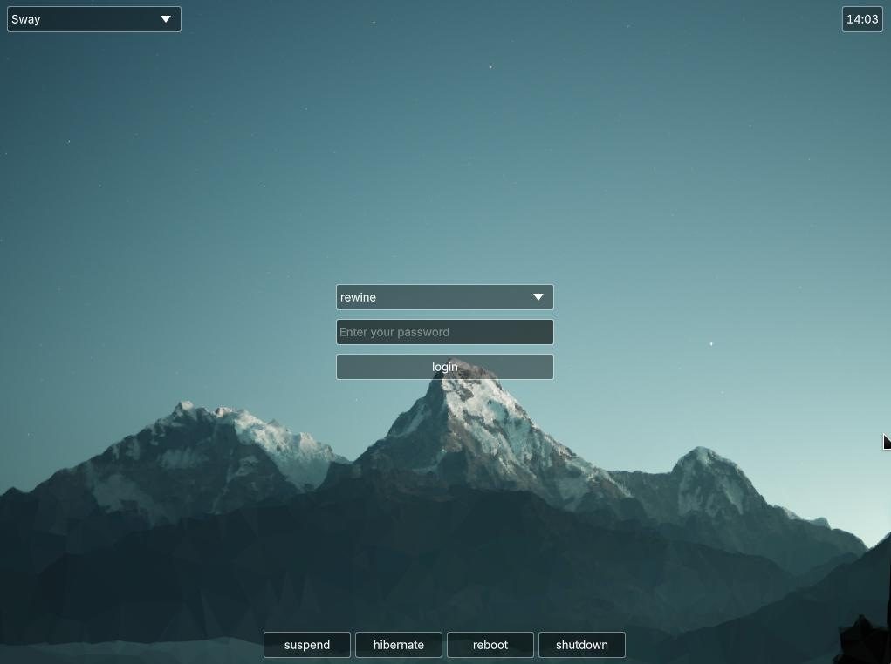

# WayGreet

A simple greeter for greetd, still in develop...




Edit the greetd config file (/etc/greetd/config.toml) to set WayGreet as the default session:
```
[default_session]
command = "waygreet"
user = "greeter"
```

#### Configuration Example

```
[General]
cursorSize=@Size(24 24)
cursorTheme=bloom
[Theme]
background=/usr/share/wallpapers/Next/contents/images/1920x1080.png
```


#### TODO

- [ ] Optimize multi-screen support
- [ ] Basic x11 session support
- [ ] Customizable themes similar to sddm
- [ ] Keyboard layout switching
- [ ] Display and keyboard brightness control

#### Thanks to:

- [waylib](https://github.com/vioken/waylib)
- [greetd](https://sr.ht/~kennylevinsen/greetd)
- [sddm](https://github.com/sddm/sddm)
- [simplicity-sddm-theme](https://gitlab.com/isseigx/simplicity-sddm-theme)
- [qmlgreet](https://github.com/nowrep/qmlgreet)
